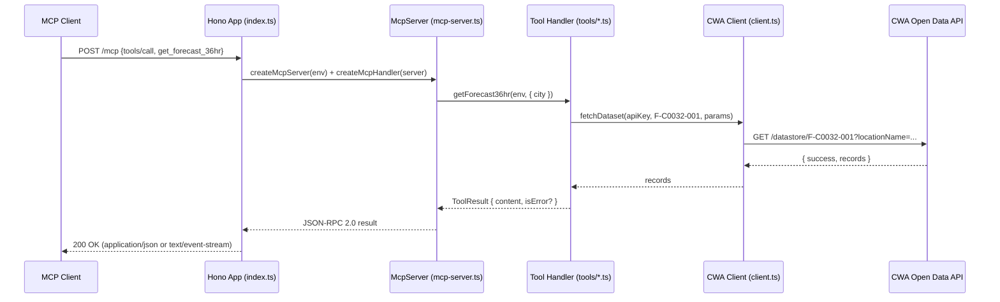
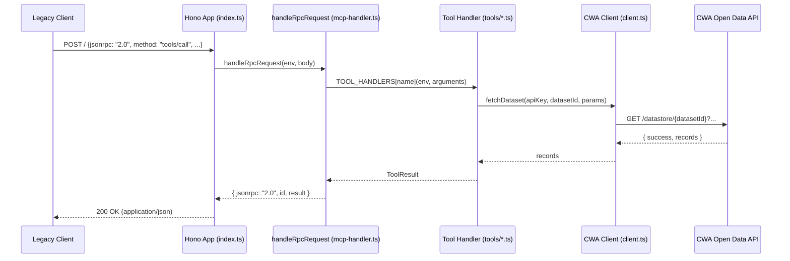

# Taiwan Weather MCP Server

提供台灣氣象資料查詢，包含天氣預報、地震、颱風、警特報、雨量、潮汐及紫外線指數，資料來源為中央氣象署開放資料平台。

## Tools

| Tool | Description | Required Params |
|------|-------------|-----------------|
| `get_forecast_36hr` | 取得台灣各縣市未來 36 小時天氣預報 | `city?` (string) |
| `get_forecast_7day` | 取得台灣各縣市未來 7 天天氣預報 | `city?` (string) |
| `get_earthquake_recent` | 取得最近地震報告 | `limit?` (number) |
| `get_typhoon_active` | 取得目前活躍颱風資訊 | (none) |
| `get_weather_warning` | 取得天氣警特報 | `city?` (string) |
| `get_rain_observation` | 取得即時雨量觀測資料 | `city?` (string) |
| `get_tidal_forecast` | 取得潮汐預報 | `port?` (string) |
| `get_uv_index` | 取得紫外線指數 | `city?` (string) |

## Endpoints

| Path | Transport | Description |
|------|-----------|-------------|
| `POST /mcp` | MCP Streamable HTTP | Claude Desktop / Cursor / MCP clients |
| `POST /` | JSON-RPC 2.0 | Legacy — Composer backward compatible |
| `GET /` | HTTP | Server info |

## Sequence Diagram

`POST /mcp` — Streamable HTTP via the MCP SDK (primary path for Claude Desktop / Cursor):



`POST /` — legacy JSON-RPC path (bypasses the SDK, dispatches straight to the tool handler map in `mcp-handler.ts`):



## Quick Start

### Prerequisites
- CWA (中央氣象署) API Key: [https://opendata.cwa.gov.tw/user/authkey](https://opendata.cwa.gov.tw/user/authkey)

### Development
```bash
npm install
npm run dev    # http://localhost:8787
npm test       # 66 tests
```

### Environment Variables
| Variable | Required | Description |
|----------|----------|-------------|
| SERVER_NAME | Auto | Set in wrangler.toml (`taiwan-weather`) |
| SERVER_VERSION | Auto | Set in wrangler.toml (`1.0.0`) |
| CWA_API_KEY | Yes | 中央氣象署 API 授權碼 (`wrangler secret put CWA_API_KEY`) |

## Usage Example

```bash
# MCP Streamable HTTP — list tools
# Note: Accept header must include both application/json and text/event-stream
curl -X POST http://localhost:8787/mcp \
  -H "Content-Type: application/json" \
  -H "Accept: application/json, text/event-stream" \
  -d '{"jsonrpc":"2.0","id":1,"method":"tools/list"}'

# Call a tool — 取得台北市 36 小時天氣預報
curl -X POST http://localhost:8787/mcp \
  -H "Content-Type: application/json" \
  -H "Accept: application/json, text/event-stream" \
  -d '{"jsonrpc":"2.0","id":1,"method":"tools/call","params":{"name":"get_forecast_36hr","arguments":{"city":"臺北市"}}}'
```

## Data Source
- **API**: CWA 中央氣象署開放資料平台 (`https://opendata.cwa.gov.tw/api/v1/rest/datastore`)
- **Auth**: API Key (Authorization header)
- **Rate Limit**: CWA 免費帳號有每日呼叫次數限制

## File Structure
```
src/
  index.ts         — Hono HTTP entry + /mcp route
  mcp-server.ts    — McpServer factory (Zod schemas)
  mcp-handler.ts   — Legacy JSON-RPC handler
  client.ts        — CWA API client
  types.ts         — TypeScript types
  tools/
    forecast.ts    — 36hr / 7day forecast
    earthquake.ts  — Earthquake reports
    typhoon.ts     — Active typhoon info
    warning.ts     — Weather warnings
    rain.ts        — Rain observation
    tidal.ts       — Tidal forecast
    uv.ts          — UV index
tests/             — Vitest tests (66 tests)
wrangler.toml      — Worker config
package.json       — Dependencies
```
