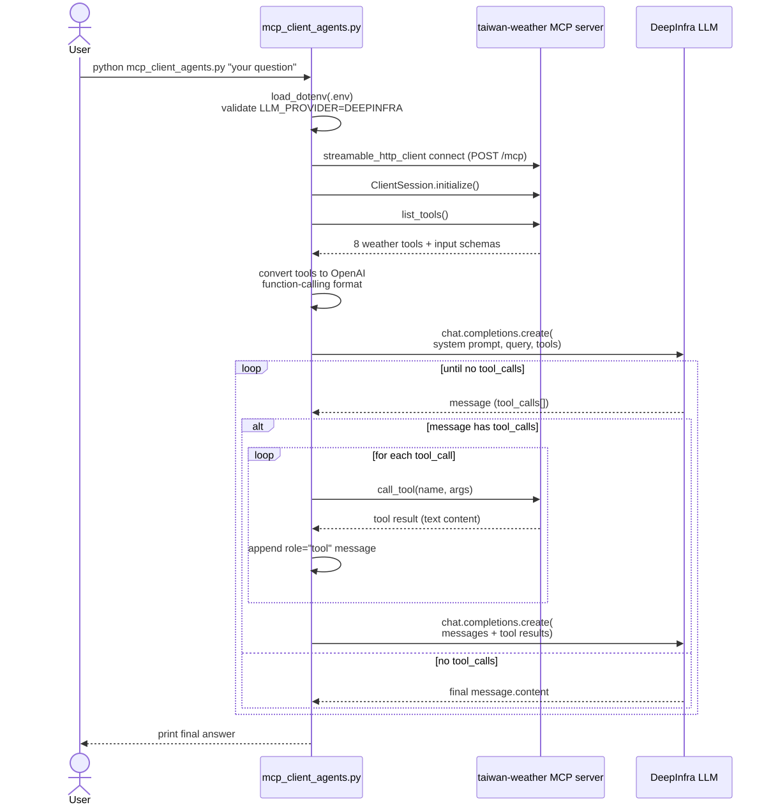
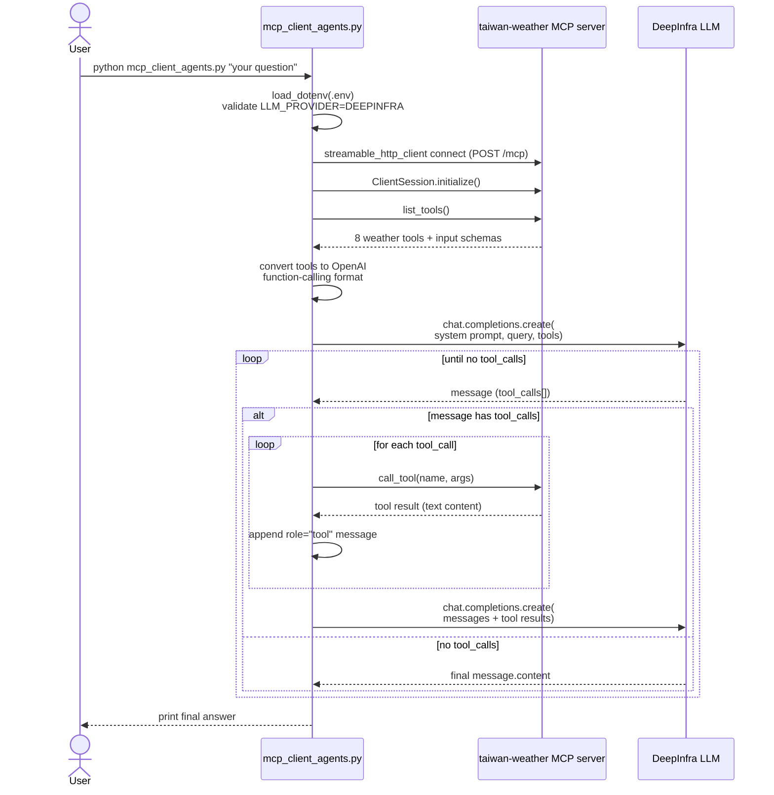

# mcp_client_agents.py

An agentic MCP client for the `taiwan-weather` MCP server. It connects over MCP
Streamable HTTP, discovers the server's tools, and drives a DeepInfra
(OpenAI-compatible) LLM through a tool-use loop until the model has enough
data to answer one query.

## Flow



<details>
<summary>Mermaid source (renders natively on GitHub; regenerate the SVG above if you edit this)</summary>



</details>

## What each step does

1. **Startup** — loads `LLM_PROVIDER`, `DEEPINFRA_MODEL`, `DEEPINFRA_BASE_URL`,
   `DEEPINFRA_API_KEY` from `.env` (resolved relative to this file, so it
   works regardless of the caller's working directory).
2. **Connect** — opens a Streamable HTTP session to the running
   `taiwan-weather` server (`MCP_SERVER_URL`, default
   `http://localhost:8787/mcp`) and calls `list_tools()` to discover the 8
   weather tools and their JSON schemas.
3. **Tool conversion** — maps each MCP `Tool` to an OpenAI
   `{"type": "function", "function": {...}}` entry, since DeepInfra's
   `/v1/openai` endpoint speaks OpenAI-style function calling, not MCP's
   native tool format.
4. **Tool-use loop** — sends the conversation to the LLM. If the response
   includes `tool_calls`, each one is executed against the live MCP server
   via `session.call_tool(name, args)`, and the result is fed back as a
   `role: "tool"` message. This repeats until the LLM responds with plain
   text instead of a tool call.
5. **Answer** — the final `message.content` is printed to stdout.

## Setup

```bash
python3 -m venv venv
source venv/bin/activate
pip install -r requirements.txt
```

Create `.env` in this directory:
```
LLM_PROVIDER=DEEPINFRA
DEEPINFRA_MODEL=deepseek-ai/DeepSeek-V4-Flash
DEEPINFRA_BASE_URL=https://api.deepinfra.com/v1/openai
DEEPINFRA_API_KEY=<your-key>
```

## Run

```bash
# in another terminal:
cd .. && npm run dev   # starts taiwan-weather at http://localhost:8787

# then:
python mcp_client_agents.py "台北市明天會下雨嗎？需要帶傘嗎？"
```
